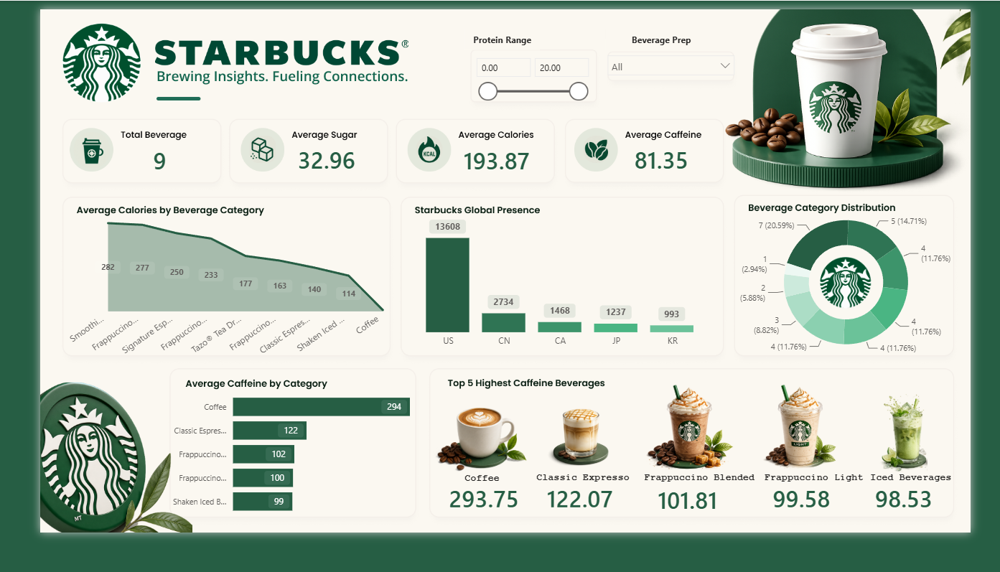

☕ Starbucks Power BI Dashboard — Brewing Insights, Fueling Connections

An end-to-end Power BI dashboard built from scratch using real Starbucks nutritional and global store location data. This project analyzes 240+ beverages across calories, sugar, caffeine, and protein content, alongside Starbucks' global store footprint across 13,000+ locations.

📌 Project Overview

This dashboard was built to simulate a real-world business intelligence use case — helping stakeholders understand product nutrition trends and global expansion patterns at a glance. It combines two real datasets (beverage nutrition + global store directory) into a single interactive report with dynamic filtering.

🔑 Key Features

KPI Cards: Total Beverages, Average Sugar, Average Calories, Average Caffeine
Interactive Filters: Protein range slider, Beverage Prep dropdown (Short/Tall/Grande/Venti)
Average Calories by Beverage Category — area chart ranking categories from highest to lowest calorie count
Starbucks Global Presence — bar chart of store counts by top countries (US, China, Canada, Japan, South Korea)
Beverage Category Distribution — donut chart showing proportional share of each category
Average Caffeine by Category — horizontal bar chart comparing Coffee, Espresso, Frappuccino, and Iced beverages
Top 5 Highest Caffeine Beverages — visual callout cards with images

🛠️ Tools & Techniques

Power BI Desktop — report design, DAX measures, Power Query transformations
Power Query — data cleaning, column type fixes, category standardization
DAX — custom measures for averages, KPI aggregations, and dynamic titles
Data Modeling — relationship handling between nutrition and store directory datasets

📊 Datasets Used

DatasetDescriptionRowsstarbucks.csvBeverage nutrition facts (calories, sugar, caffeine, protein, fat, etc.)242directory.csvGlobal Starbucks store directory (location, ownership type, timezone)25,600+

📈 Key Insights

Smoothies and Frappuccinos top the calorie chart, while brewed Coffee is the lowest-calorie option
Coffee has by far the highest average caffeine content (~294mg) among all categories
The US dominates global store count (13,608 stores), followed by China (2,734) and Canada (1,468)
Beverage categories are fairly evenly distributed, with no single category holding more than ~21% share

🚀 How to Use

Clone this repository
Open Starbucks_Dashboard.pbix in Power BI Desktop
Use the Protein Range slider and Beverage Prep dropdown to explore the data interactively

📂 Repository Structure

starbucks-powerbi-dashboard/
│

├── data/

│   ├── starbucks.csv          # Beverage nutrition dataset

│   └── directory.csv          # Global store directory dataset

├── Starbucks_Dashboard.pbix   # Power BI report file

├── assets/
│   └── dashboard_preview.png  # Dashboard screenshot

└── README.md

👤 About Me

Built by Mo Talha Khan — B.Tech IT graduate transitioning into Data Analytics, with hands-on experience in Power BI, SQL, and Python. This project is part of my data analyst portfolio.

🔗 https://www.linkedin.com/in/motalhakhan/
📧 mo.talhaakhan@gmail.com

⭐ If you found this project useful, consider giving it a star!
